# Leandro: ableton-style audio synthesis software

<a href="https://creativecommons.org/licenses/by-nc-sa/4.0/?ref=chooser-v1"></a>

Leandro is a piece of software that explores different methods of audio synthesis and different audio filters, written entirely in C++, using portaudio and Qt.

It synthesizes notes from MIDI files using its own instruments and audio filters. After importing a .MIDI file, the user can choose from the different synthesizing methods and combine any number of filters and the melody will be generated accordingly.

Everyone loves images, so here's a screenshot of Leandro's main screen in action:

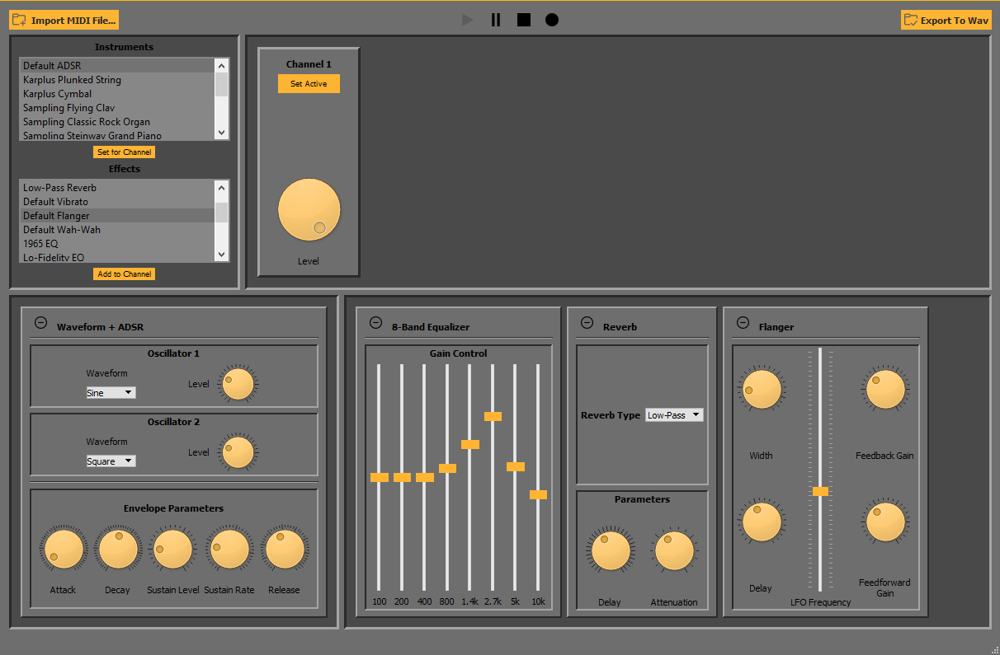

Leandro also supports multi-channel MIDI files, and allows for each channel to have its own synthesis method and assortment of audio filters:

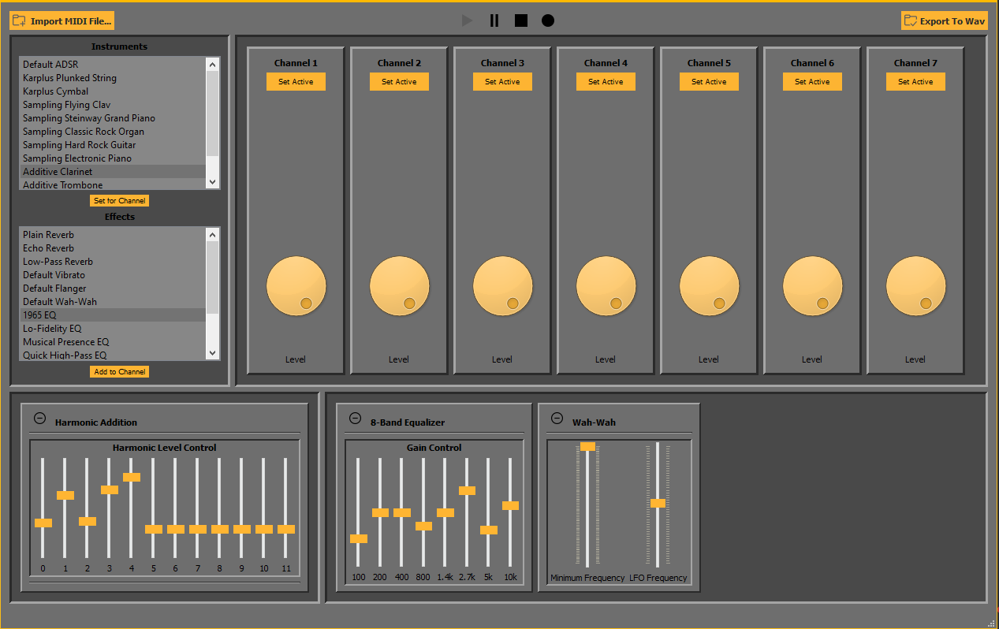

After experimenting with different "instruments" and filters, you might like what you hear: the session's recording can be started and stopped at any point, and .wav files can be saved with the contents of those recordings.

# Table of Contents

* [Fast Fourier Transform](fast-fourier-transform)
* [Sample-Based Synthesis](sample-based-synthesis)
* [Additive Synthesis](additive-synthesis)
* [Sound synthesis using physical models](sound-synthesis-using-physical-models)
* [Waveform synthesis](waveform-synthesis)
* [Random behavior](random-behavior)
* [Digital Effects](digital-effects)
* [Program implementation](program-implementation)

## Fast Fourier Transform
>[Table of contents](#table-of-contents)

### Theory
>[Fast Fourier Transform](fast-fourier-transform)

To apply the Fast-Fourier-Transform algorithm, we used the Decimation-in-time algorithm, better known as the Cooley-Tukey algorithm, which will be developed below.

Starting from the assumption that what you want to obtain is,

$$X(k)=\sum_{n=0}^{N-1} x(n) W_N^{-kn} \, , \,\,\, W_N = e^{j2\pi /N}$$

Taking this into account, and knowing that $N$ can be written in the form $N=2^{r}$ being $r\in\mathbb{N}$, we can split this summation into even and odd parts, leaving,

$$X(k)=\sum_{n=0}^{N/2 -1} x(2n)W_{N/2}^{-kn} + W_N^{-k} \sum_{n=0}^{N/2-1} x(2n+1)W_{N/2}^{-kn} $$

Therefore, if we call $x_p(n)=x(2n)$ and $x_i(n)=x(2n+1)$, we can rewrite the expression as,

$$X(k)=X_p(k)+W_N^{-k}X_i(k)$$

Finally, given the periodicity $X_p(k+frac{N}{2}) = X_p(k)$ and $X_i(k+frac{N}{2}) = X_i(k)$

We obtain that,

$$X\left(k+\frac{N}{2}\right) = X_p(k) - W_N^{-k}X_i(k)$$

Finally, from the expression above, we can see that by saving the values obtained for half of the FFT interval, we can reuse them to calculate the missing half.
The Cooley-Tukey algorithm uses this property, recursively subdividing the odd and even parts until we arrive at a function with only one element.

### Implementation
>[Fast Fourier Transform](fast-fourier-transform)

The implementation of the algorithm can be seen below.

```c++
void fft(std::complex<float>* in, std::complex<float>* out, size_t n) {
    vector<complex<double>> temp;
    for (size_t i = 0; i < n; i++)
        temp.push_back(in[i]);
    temp = Cooley_Tukey(temp);
    for (size_t i = 0; i < temp.size(); i++)
        out[i] = temp[i];
    return;
}

std::vector<complex<double>> Cooley_Tukey(std::vector<complex<double>>& samples) {
    unsigned int numSamples = samples.size();

    if (numSamples <= 1)
        return samples;
    unsigned int newSampleSize = numSamples / 2;
    std::vector<complex<double>> Xeven(newSampleSize, 0);
    std::vector<complex<double>> Xodd(newSampleSize, 0);

    for (unsigned int i = 0; i < newSampleSize; i++) {
        Xeven[i] = samples[2 * i];
        Xodd[i] = samples[2 * i + 1];
    }
    std::vector<complex<double>> Feven(newSampleSize, 0);
    std::vector<complex<double>> Fodd(newSampleSize, 0);

    Feven = Cooley_Tukey(Xeven);
    Fodd = Cooley_Tukey(Xodd);

    std::vector<complex<double>> freqBins(numSamples, 0);

    for (unsigned int i = 0; i < (numSamples / 2); i++) {
        complex<double> cmplxExponential = polar(1.0, (-2 * 3.14159 * i / numSamples)) * Fodd[i];
        freqBins[i] = Feven[i] + cmplxExponential;
        freqBins[i + numSamples / 2] = Feven[i] - cmplxExponential;
    }
    return freqBins;
}
```

### Results
>[Fast Fourier Transform](fast-fourier-transform)

Comparing the results for the data sequence expressed in the equation below, using the python FFT function yielded the results shown in the figure below.

$$x(n) = 10 sin(2\pi100 n T) + 5 sin(2\pi 200 n T) + 2.5 sin(2\pi 300 n T)\\
    T=\frac{1}{800} \,\, and \,\, 0<n<4096$$

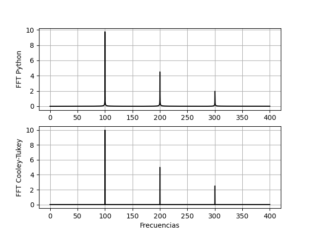

## Sample-Based Synthesis
>[Table of contents](#table-of-contents)

### Introduction

Sample-based synthesis is very different from other forms of synthesis such as additive synthesis. As seen above this type of synthesis uses basic functions such as sine, square, triangle or sawtooth to synthesize different sounds. However, sample-based synthesis uses a sample to recreate another sound. This sample, henceforth referred to as a sample, can be a recorded sound or instrument. Consequently, this form of synthesis allows you to recreate a more realistic sound since you are working on a real sound. In addition, it is less demanding on the CPU than other forms of synthesis, such as synthesis using physical models, since the output signal is not calculated in real time but pre-recorded samples are used. However, this type of synthesis involves a similar difficulty. Suppose you want to synthesize a piano. By this method it is possible but it would require to have pre-recorded all the notes of the piano with all the possible durations. This is clearly impossible since the memory is finite. For this reason, algorithms are used to perform time and frequency stretching and compression to form from a pre-recorded note another note with different frequency and different duration. This is the objective of this section, to be able to determine an appropriate algorithm so that, from a recorded note, another note of different frequency and duration can be created. In this way, with just a few samples, we can synthesize an instrument. Taking all this into consideration, it is proposed to synthesize a piano.

### Pitch shifting

First, the possibility of modifying the pitch of a note is analyzed. The pitch is one of the four essential qualities of sound. It determines whether a sound is high-pitched or low-pitched. The higher the frequency, the higher the pitch, and the lower the frequency, the lower the pitch. The Pitch is determined by the fundamental frequency of the signal.

Understanding these basic notions, the objective of this sub-section is defined. Starting from a sound with a certain Pitch, such as a piano note, we want to modify its fundamental frequency in order to generate another note with the same duration as the original one. This is possible by means of a frequency shift or pitch shifting. This process involves two steps: first, the pitch must be identified (Pitch Detection) and secondly, the pitch shift or correction must be made (Pitch Correction).

#### Pitch Detection

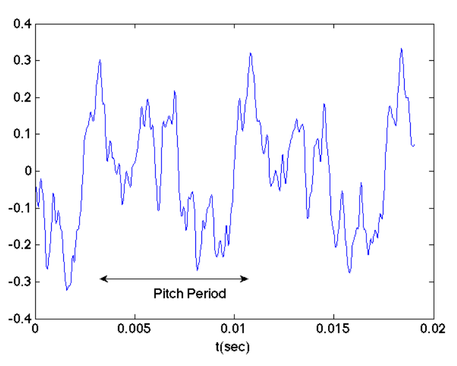
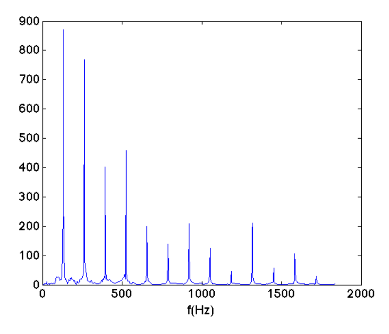

The Pitch of a signal can be analyzed in the frequency domain as well as in the time domain. The Figure above shows a simple sample of the note C3 of a piano. Note that, the frequency domain plot tells much more than the other plot. You can clearly see the peaks of the signal. The most predominant peak determines the fundamental frequency and, as stated above, the fundamental frequency is the ÒpitchÓ of the signal. For this particular signal, the Pitch is $130.8128Hz$. On the other hand, see that the graph in the time domain the Pitch is periodic. This is much less intuitive than the previous case. Therefore, the detection of the Pitch is best analyzed in the frequency domain.

Typical detection methods include autocorrelation methods or by means of magnitude difference averaging. These methods are very interesting if you do not know the signal at which pitch shifting is to be performed. However, since the objective of the section is to synthesize notes from a piano, the different Pitch are already known beforehand. Recalling music theory concepts, the frequency of the $k-th note of a piano is given by the equation:

$$f = 2^{\frac{k-49}{12}}\cdot 440Hz$$

For example, note C3 which is note number 28 has a fundamental frequency or Pitch of $130.8128Hz$, as seen in the Figure above. In summary, with equation above you have all the Pitches of all the notes of the piano. Furthermore, it follows from the equation above that each note is separated by $2^{frac{1}{12}}$. For example, if you have C3, C3 will be $130.8128Hz \cdot 2^{frac{1}{12}}$. D3 will be $130.8128Hz \cdot 2^{frac{2}{12}}$ and so on.

The following is an analysis of a Sample to demonstrate the theory described above. The analysis is performed with the free program Audacity. This program allows to perform the frequency spectrum of a Sample. Figure below shows the spectrum of a Sample of the note C4 of a classical electronic piano. The Sample was acquired using the GrageBand program.

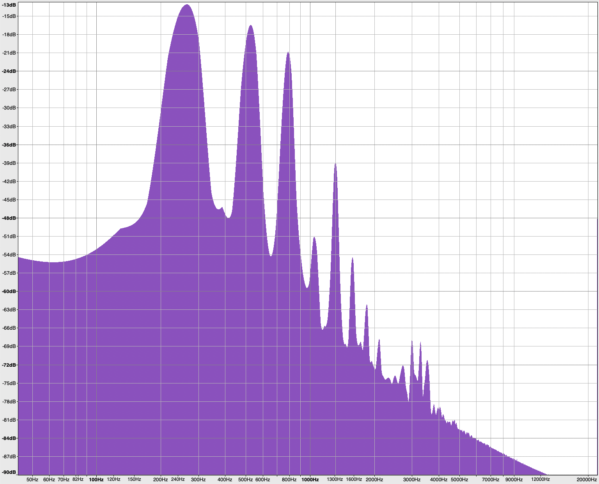

As can be seen in the Figure above, the fundamental frequency is $264Hz$ so it is effectively the note C4. This type of analysis is the one that is going to be performed to determine the Pitch of each Sample.

As a last clarification on the subject. Do not confuse Pitch which has units of Hz and is observed in the frequency domain with the Pitch Period which is the reciprocal of the Pitch, has units of second and is observed in the time domain.

#### Pitch Correction

In the previous subsection we analyzed how to determine the pitch of a Pitch of a Sample. Now we analyze how to modify or, better said, correct the Pitch of a Sample to generate a new pitch. Correction algorithms can work in the time domain or in the frequency domain. Generally those working in the frequency domain are very robust but suffer from long latencies. Therefore, a time domain method is used. 

Most of the techniques that work in the time domain to perform pitch correction are based on the TD-PSOLA method.
TD-PSOLA (Time-Domain Pith Synchronous Overlap and Add method). This is the method used in this section because it is fast, simple and, as will be shown later, has very good results.

The TD-PSOLA method can be divided into three steps:

    * Decompose the input signal into a series of short-time analysis signals.
    * Modification of the short-time analysis signals to short-time synthesis signals
    * Composition of the new signal with the short time synthesis signals. Here is the concept of overlap-add

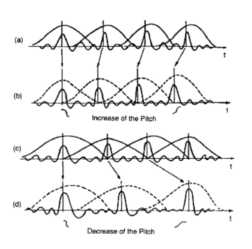

Step 3 is where the interesting thing happens. When recomposing the signal, the short time synthesis signals can overlap or move away from each other. This causes the fundamental frequency of the signal to vary. If the signals move closer together, the fundamental frequency increases (higher pitch). Conversely, if the signals move away from each other, the fundamental frequency decreases (lower Pitch). An illustration of the method is shown in the Figure above to understand how it works. Keeping in mind the steps of the method, we continue to develop each one in detail.

##### Step 1

This step consists of decomposing the input signal $x(n)$ into a sequence of short-time analysis signals, called $x(s,n)$. These signals are obtained by multiplying $x(n)$ by a sequence of time-translated analysis windows. That is:

$$x(s,n)=h_s(n)x(n-t_a(s))$$

Where $h_s(n)$ is the analysis window with support at $n=0$ and $t_a(s)$ is the s-th analysis time instant. These time instants are called pitch-marks and are the peaks in $x(n)$. In the case of piano notes, these peaks are periodic. This period is the $P(s)$ (\textit{Pitch Period}).

Returning to the analysis window, its length $T$ is proportional to $P(s)$. Generally, one usually takes $T = $P(s)$ with $P(s)$ = 2$. The shape of the window $h_s(n)$ is arbitrary. In this case the Hanning window is used because of its spectral behavior.

##### Step 2

The second step consists of transforming the sequence of short-time analysis signals into a sequence of short-time synthesis signals. The latter are synchronized with a new set of time instants $t_s(\mu)$ called synthesis pitch-marks. The set of $t_s(\mu)$ are determined by the set of $t_a(s)$ instants, depending on the Pitch correction to be performed. This is the most important concept of TD-PSOLA. Let $P_0$ be the original Pitch Period of the signal and $P_1$ be the Pitch Period of the signal to be synthesized. Then, the desired shift can be expressed as $P_1 = \frac{1}{beta} \cdot P_0$ with $\beta$ being the shift factor. For example, if one wants to synthesize C4 from C4, i.e. run a half-tone, $B = 2^{frac{1}{12}}$. In this way, the synthesized signal will have the pitch-marks of the original signal but now spaced $P_1$. These synthesis pitch-marks determine $t_s(\mu)$. Figure \ref{fig:pitch_marks} greatly aids in the compression of this step. 

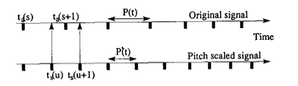

##### Step 3

Composition of the synthesized signal. We already have the synthesis pitch-marks so it would be necessary to center each short time synthesis signal to these time instants. But a small problem arises. If the duration of the original signal is to be maintained, a synthesis signal may have to be repeated in two or more synthesis pitch-marks. Then, to determine which signal is repeated we simply calculate which synthesis pitch-mark is closest to the synthesis pitch-mark being evaluated. In this way the synthesized signal is 'filled in'. Depending on the value of $\beta$ it may be that the synthesis signals are overlapped so that operlap-add must be done to form the synthesized signal.

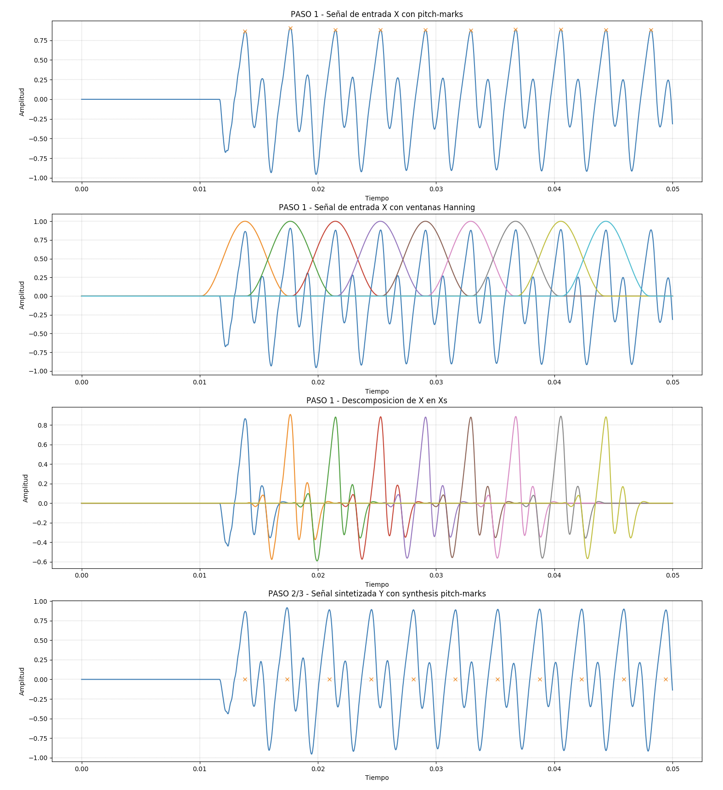

Figure above shows the method on a Sample of C4 of a classical electronic piano to synthesize C4 (fundamental frequency one semi-tone higher than C4). In the first graph, the peaks or pitch-marks of the signal separated approximately by the Pitch Period are detected. In the second graph, the windows centered on the pitch-marks are placed. The third plot shows short time analysis signals already modified by the window. The fourth graph shows the signal synthesized with the synthesis pitch-marks. It would remain to be determined whether the fundamental frequency of the synthesized signal is indeed that of C4 ($279Hz$). Figure below shows the spectrum of the synthesized signal. A shift in the fundamental frequency was indeed achieved.

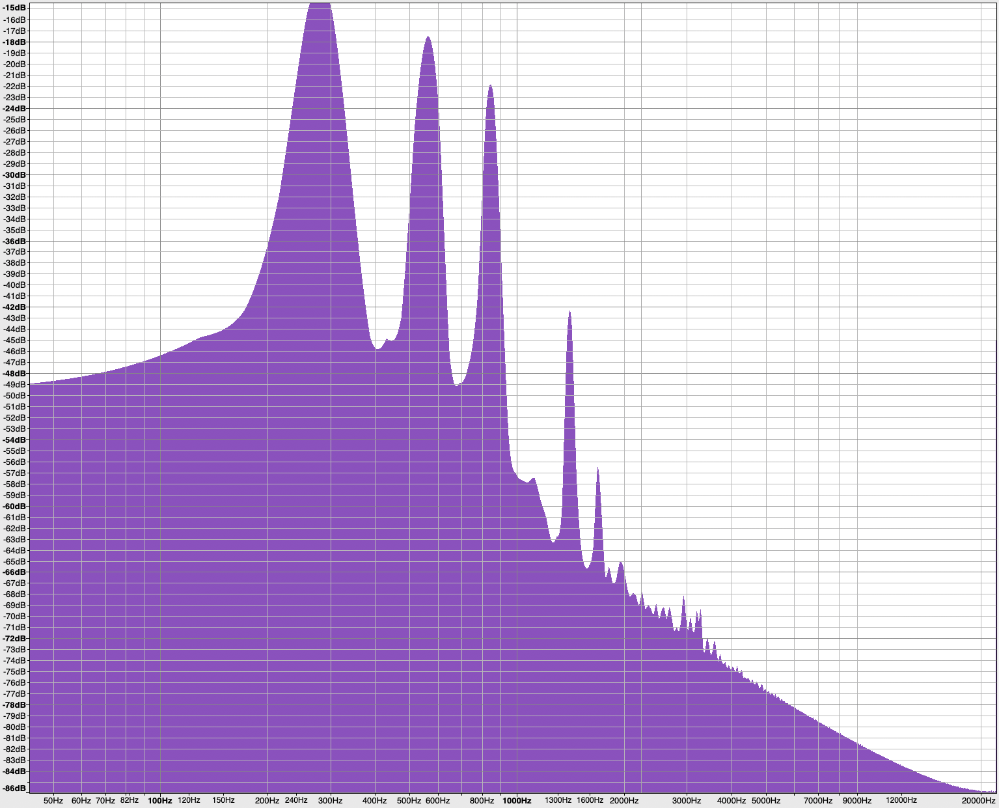

#### Conclusion

In conclusion, pitch shifting was successfully achieved on a Sample. It was possible to perform the shift of the fundamental frequency of the sample while maintaining the duration of the sample. As additional considerations, it is possible to work using different windows such as Barlett or similar and with different width to analyze the different results.  

### Time-scale Modification

Second, temporal scaling is analyzed. The method to perform the scaling is very similar to the method to perform the pitch shifting. The difference is that now we are not interested in changing the Pitch but, what we want is to modify the time of the signal. To achieve this, the TD-PSOLA method is also used. The steps of the method are the same as those described in Pitch Correction and others suffer some changes. Step 1 remains exactly the same, the signal is decomposed into a series of short time analysis signals. Step 2 undergoes a small correction. Remember that now you want to have the same Pitch so the distance between each synthesis signal must have the same distance from each other as the analysis signals. This would be $P_0 = P_1$. From this follows the main problem. Suppose one wants to shorten the signal time. Then, some synthesis signals must be removed so that the total time is reduced but the Pitch remains the same. The opposite happens if you want to increase the signal time. To achieve this, synthesis signals must be repeated to fill the time. Once the position of each synthesis signal is known, it is possible to continue with step 3 and compose the final signal.

Figure below shows an illustration of the time modification method.

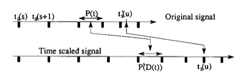

#### Implementation

This section explains the implementation of the previously described methods to achieve the synthesis by Òtextit{samples} of a piano. 

First, the samples or samples were searched. To synthesize a piano we consider using the samples of the notes C1,C2,C3,C4,C5,C6. This allows us to synthesize all the samples since we have one sample per octave. That is to say, if you want the note D3 you will use the sample C1 to make the corresponding frequency shift. If A5 is desired, use C5 and so on. As you can see, each octave sample can synthesize 11 notes (each octave is separated by 12 notes). Once we have the samples, we continue to make a spectral analysis of each one to determine its fundamental frequency. Having everything necessary, we continue to apply the methods previously explained.

Figure below shows a modification of a C4 note. The first graph shows the original signal, the third one shows C4 with a two semitone shift and the last one shows a temporal lengthening of the sample. The second graph shows something interesting. Notice that fragments of the signal are repeated to fill the time. This was implemented this way because this is how sample synthesizers work. The user is always given the option to select the fragment of the signal to be repeated in case you want to synthesize a signal with a longer duration than the original signal.


### Conclusion

It was possible to understand the basics of sample synthesis, its operation and implementation. It was possible to perform the time shift and the fundamental frequency to synthesize any note of a piano. 

With the knowledge acquired, it was possible to synthesize several instruments such as a steinway piano, an electric piano, a guitar, among others. 

## Additive Synthesis
>[Table of contents](#table-of-contents)

### Introduction

Additive synthesis is based on the concept of Fourier Series, specifically on the fact that a periodic signal can be written as a sum of sinusoidal signals of different frequencies and amplitudes:

$$y(t) = \sum _{k=1}^N{A_k cos\left(2\pi k f_0 + \phi_k\right)}$$

The expression above allows generating uniform periodic functions, but these signals do not faithfully represent the signal generated by an instrument. Each instrument has a certain tone, that is, its sound has a characteristic harmonic power distribution. In addition to a characteristic tone, the sound of the instrument is characterized by the amplitude envelope that modulates its sound.

Then, the signal of an instrument can be modeled as a sum of signals of different frequencies which we will call partial, since they do not necessarily have to be integer multiples of the central frequency of the signal as indicated by the expression above. Furthermore, these coefficients $A_k$ corresponding to each partial are modulated by a time envelope, and then we arrive at:

$$y(t) = \sum _{k=1}^N{A_k(t) cos\left(2\pi k f_0 + \phi_k\right)}$$

Considering the above, two additive synthesis models were proposed in this report. The first of them, which we will denote ADSR, proposes that the envelope that modulates in amplitude is the same for all the partials that make up the signal. The second proposal assumes, as stated in te expression above, that each partial is modulated by a different envelope $A_k(t)$. The following sections explain the procedure implemented to obtain the models of 4 different instruments using the second synthesis proposal.

### Getting parameters

It was proposed to implement the additive synthesis of 4 instruments: piano, clarinet, trombone and trumpet. For each of these instruments, audio samples were taken in .wav format, and a very selective band-pass filter was applied to them, so that the envelope signal $A_k(t)$ corresponding to the partial of interest $k$ could be obtained. Particularly, the first 12 harmonics of the signals were selected.

This methodology was repeated for a sample of each octave belonging to the set of octaves that the instrument is capable of reproducing, given that when you want to synthesize a note of, for example, the 6th octave, its synthesis will be more faithful if its parameters were obtained of a sample corresponding to that octave and not, for example, to the 1st octave.

#### Development of A5 piano parameters

In order to explain the methodology implemented, the method for the note A belonging to the 5th octave for an acoustic piano will be developed. First, the envelope curves were taken from a sample of a .wav file for the first 12 harmonics, that is, for $f=kf_0$, with $k = 1, 2, ...,12$ and $f_0 = 880.0 Hz$


Figure above shows the distribution of the envelopes for the 12 selected partials. Then, when synthesizing a note, the expression was applied using the $A_k(t)$ corresponding to the octave of the note to be synthesized.

Below is the Python code used to obtain the mentioned data:

```python
import numpy as np
from numpy import sign
from scipy import signal, interpolate
import matplotlib.pyplot as plt
import math
from scipy.io import wavfile
from distutils.spawn import find_executable
import aifc
import xlsxwriter
import math
from scipy import fftpack

file = 'samples/A5-880.0.wav'
oct = 5

if find_executable('latex'):
    plt.rc('font', **{'family': 'serif', 'serif': ['Palatino'], 'size': 17})
    plt.rc('text', usetex=True)

peaks = []
datas = []
freqs = []

octave_envelopes = []
rate, data = wavfile.read(file)
d = data.astype(float)
d = (data[:,0] + d[:,1]) / 2
maxD = max(d) 
data = [i/maxD for i in d[0:441000]]
t = np.arange(len(data))/rate
f0 = float(file.split('.')[0].split('-')[-1])

plt.plot(data)
plt.show()

for i in range(1,13):
    fi = i * f0
    freqs.append(fi)
    fs1 = 0.9*fi
    fs2 = 1.1*fi
    ws = [fs1, fs2]

    fp1 = 0.95*fi
    fp2 = 1.05*fi
    wp = [fp1, fp2]

    N, wn = signal.ellipord(wp, ws, 0.5, 50,fs=rate)
    sos = signal.ellip(N, 1, 100, wn, 'bandpass', output='sos',fs=rate)

    filtered = signal.sosfilt(sos, data)
    filtered = np.array(filtered)

    q_u = np.zeros(filtered.shape)

    u_x = [0,]
    u_y = [filtered[0],]

    for k in range(1, len(filtered)-1):
        if (sign(filtered[k]-filtered[k-1])==1) and (sign(filtered[k]-filtered[k+1])==1):
            u_x.append(k)
            u_y.append(filtered[k])
    u_p = interpolate.interp1d(u_x, u_y, kind='cubic', bounds_error=False, fill_value=0.0)

    envelope = []
    for k in range(0, len(filtered)):
        envelope.append(u_p(k))

    del envelope[1::2]
    octave_envelopes.append([envelope])
    t = np.arange(len(envelope)) / rate
    plt.plot(t[:rate],envelope[:rate], label='Harmonico: ' + str(i))

plt.xlabel('Tiempo [seg]')
plt.ylabel('Amplitud')
plt.grid('minor')
plt.legend()
plt.show()

with xlsxwriter.Workbook('OCT' + str(oct) + '.xlsx') as workbook:
    worksheet = workbook.add_worksheet()
    for col, data in enumerate(octave_envelopes):
        dat = data[0]
        max_data = max(dat)
        dat = [i for i in dat]
        worksheet.write_column(0, col, dat)
```

### Parameters

The parameters that were presented to the GUI user to modify the synthesis model in question were the coefficients of each of the 12 harmonics that make up the signal, that is, they were given the possibility of modifying the amplitudes of its components. spectral, to give the instrument different tones.

### Results

Below is the result obtained using the aforementioned method for the synthesis of an acoustic piano note.

It was observed that the syntheses corresponding to the wind instruments result in a quality that is more faithful to the synthesis of the piano.


## Sound synthesis using physical models
>[Table of contents](#table-of-contents)

### Introduction
There are many musical synthesis techniques, which include frequency modulated (FM) synthesis, waveshaping, additive and subtractive synthesis, but to achieve fidelity sounds they require arithmetic speed that can be found in highly processing computers or digital synthesizers, inaccessible to most. This type of synthesis allows its application in a simple way and on most computers on the market.
It is not only an algorithm that can be easily applied in software, but also in hardware. Compared to additive synthesis, the sound of the plucked string is much more natural and fluid since in experiments a sine wave generator was needed to produce a similar tone (Sleator 1981).

### Waveform synthesis
This method is one of the bases to explain the synthesis through physical models. It consists of repeating a number of samples continuously to generate a pure periodic signal.

$$y\left(n\right)=y\left(n-p\right)$$

The resulting tone is determined by the initial conditions of the recurrence relation. A waveform (sine, triangular, square, etc.) is loaded into a table with a specific sampling frequency $\left(f_s\right)$, which will synthesize a tone whose frequency is determined by the frequency of sampling and the periodicity $\left(p\right)$ of the system.

$$f_t=\frac{f_s}{p}$$

This technique is very simple but musically vague because the tones are purely periodic and, in reality, instruments produce sounds that vary temporally. Without modifications in the table, the harmonic content of the tone is fixed, however in order not to lose the frequency of the specified tone, the period-to-period changes of the samples should be small. To maintain the low level of complexity in the processing we can modify only the sample we are reading.

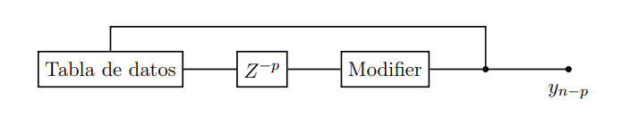

#### Plucked String Algorithm
The modification proposed by Alex Strong involved the modifier being an averager of two successive samples.

$$y_n=\frac{y_{n-p}+y_{n-p-1}}{2}$$

The effect caused by this modification involves a smooth decay of the waveform at a rate that differs according to the different harmonics. As a result we obtain a very natural sound, which regardless of the original spectrum, will decay in an almost pure sinusoidal form to a constant that will end in silence. From a hardware point of view, the operations necessary to achieve this method are low complexity and only focus on a binary addition and shift.


$$T_s = p+\frac{1}{2}\rightarrow f_t=\frac{f_s}{p+\frac{1}{2}}$$

Given the recurrence relationship we must preload the table with initial values. It is advisable to use random values ​​at the beginning of each note because they have most of their spectral content in the high acoustic frequencies. As long as the samples are repeated periodically, the randomness will not produce hisses or clicks. The subtle spectral variation is enough to make it seem like it comes from the same instrument but insufficient for the sound to not resonate mechanically.

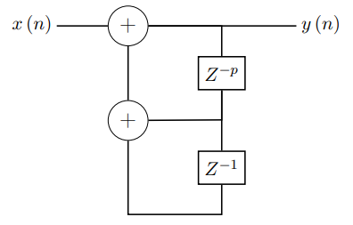

Without the decay algorithm, a table of random values ​​has equal harmonics up to the nyquist frequency and sounds like an electric organ (reed organ).

#### Random behavior

To generate the initial conditions we will use double-level random samples.


$$y_t= \left\lbrace\begin{gathered}
+A,prob=0.5\\
-A,prob=0.5
\end{gathered}
\right.
-p\leq t \leq 0$$

The root mean square value of the output amplitude $\left(A\right)$ corresponds to half the peak-to-peak amplitude of the signal. Using this random method instead of a uniform distribution can result in a stronger $5[db]$ signal.
There are limitations on the value of the periodicity $\left(p\right)$. If it is small, the variation between the different initial conditions will be relatively long resulting in a loose control of the amplitude. Since the amplitude or pitch of a note is determined by the value of the variable, in addition to the fact that it must have an integer value, not all frequencies are available. To obtain better frequency resolution we can also modify the sampling frequency. If the variable changes frequently between notes a glissando and vibrato effect will occur. It should also be noted that for the generation of random noise, it is advisable to use a distribution whose spectrum is as extended as possible so that the effect of the synthesizer filter can be seen throughout their range.

##### Analytical transfer of the original model
We have to separate the process into two parts. On the first, we have a set of $p$ random noise samples $x\left[-p,-1\right]$ and, we begin to obtain the first n outputs of the system.


$$y\left(n\right)=R_L\cdot \frac{x\left(n-p\right)+x\left(n-p-1\right)}{2};$$

The second part involves the recursive process where only the output and its delayed values ​​are involved.

$$y\left(n\right)=R_L\cdot \frac{y\left(n-p\right)+y\left(n-p-1\right)}{2};$$

The total system is represented as follows.

$$H\left(z\right)=\frac{z^{-p}+z^{-\left(p+1\right)}}{\frac{2}{R_L}z^{p+1} -z-1}$$

We analytically obtain the frequency response of the model taking into account the periodicity as a function of the frequency of the synthesized note.

$$\begin{gather*}
\textit{Function Poles}\\
\frac{2}{R_L}z^{p+1}-z-1 = 0 \rightarrow \frac{2}{R_L}z^{p+\frac{1}{2}}=z^{\frac{1}{2}}-z^{-\frac{1}{2}}\\ \frac{2}{R_L}a^{p+\frac{1}{2}}e^{i\omega\left(p+\frac{1}{2}\right)}=a^{\frac{1}{2}}e^{i\frac{\omega}{2}}+a^{-\frac{1}{2}}e^{-i\frac{\omega}{2}}=\sqrt{a+a^{-1}+2cos\left(\omega\right)}\cdot e^{i\theta}\\
\textbf{Through the imaginary part we look for the relationship of $\theta$ with $\omega$}\\
\left.\begin{gathered}
\sqrt{a+a^{-1}+2cos\left(\omega\right)}\cdot sen\left(\theta\right)=\left(a^{\frac{1}{2}}-a^{-\frac{1}{2}}\right)\cdot sen\left(\frac{\omega}{2}\right)\\
a = 1-\epsilon\approx 1\rightarrow a+a^{-1}=2+\epsilon^2+\epsilon^3...\approx 2\\
a^{\frac{1}{2}}-a^{-\frac{1}{2}}\approx 0
\end{gathered}\right\rbrace sen\left(\theta\right)\approx 0\rightarrow e^{j\omega\left(p+\frac{1}{2}\right)}=e^{j\theta}\approx 1\\
\textit{Normalized angular frequency of each partial - poles}\rightarrow \omega=\frac{\theta+2\pi n}{p+\frac{1}{2}}\approx \frac{2\pi n}{p+\frac{1}{2}}\\
\textit{Module of the corresponding poles}\rightarrow
a\approx \left(R_L\cdot cos\left(\frac{\omega}{2}\right)\right)^{\frac{1}{p+\frac{1}{2}}}=\left(R_L\cdot cos\left(\frac{2\pi n}{2p+1}\right)\right)^{\frac{1}{p+\frac{1}{2}}}\\
\textit{Stability condition for each pole according to $R_L$}\rightarrow R_L \leq \frac{1}{cos\left(\frac{2\pi n}{2p+1}\right)}	
\end{gather*}$$

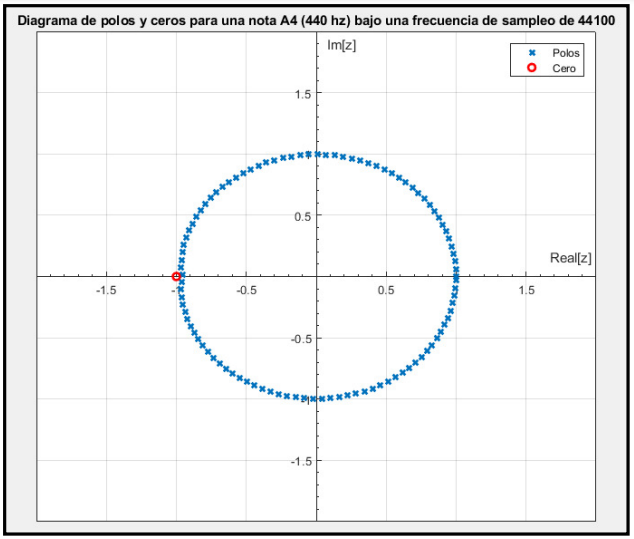

## Digital Effects
>[Table of contents](#table-of-contents)

## Program implementation
>[Table of contents](#table-of-contents)


# Contact
>[Table of contents](#table-of-contents)

Please do not hesitate to reach out to me if you find any issue with the code or if you have any questions.

* Personal email: [ianczdiaz@gmail.com](mailto:ianczdiaz@gmail.com)

* LinkedIn Profile: [https://www.linkedin.com/in/iancraz/](https://www.linkedin.com/in/iancraz/)

# License
>[Table of contents](#table-of-contents)

<a href="https://creativecommons.org/licenses/by-nc-sa/4.0/?ref=chooser-v1"></a>

<p xmlns:cc="http://creativecommons.org/ns#" xmlns:dct="http://purl.org/dc/terms/"><a property="dct:title" rel="cc:attributionURL" href="https://github.com/iancraz/Music-Synthesizer">Music Synthesizer</a> by <a rel="cc:attributionURL dct:creator" property="cc:attributionName" href="https://www.linkedin.com/in/iancraz/">Ian C. Diaz</a> is licensed under <a href="https://creativecommons.org/licenses/by-nc-sa/4.0/?ref=chooser-v1" target="_blank" rel="license noopener noreferrer" style="display:inline-block;">CC BY-NC-SA 4.0</a></p>

```
You are free to:
    Share — copy and redistribute the material in any medium or format

    Adapt — remix, transform, and build upon the material

The licensor cannot revoke these freedoms as long as you follow the license terms.
Under the following terms:
    Attribution — You must give appropriate credit , provide a link to the license,
    and indicate if changes were made. You may do so in any reasonable manner, but 
    not in any way that suggests the licensor endorses you or your use.

    NonCommercial — You may not use the material for commercial purposes.

    ShareAlike — If you remix, transform, or build upon the material, you must 
    distribute your contributions under the same license as the original.

    No additional restrictions — You may not apply legal terms or technological 
    measures that legally restrict others from doing anything the license permits.

Notices:

You do not have to comply with the license for elements of the material in the 
public domain or where your use is permitted by an applicable exception or 
limitation.

No warranties are given. The license may not give you all of the permissions 
necessary for your intended use. For example, other rights such as publicity, 
privacy, or moral rights may limit how you use the material.
```
